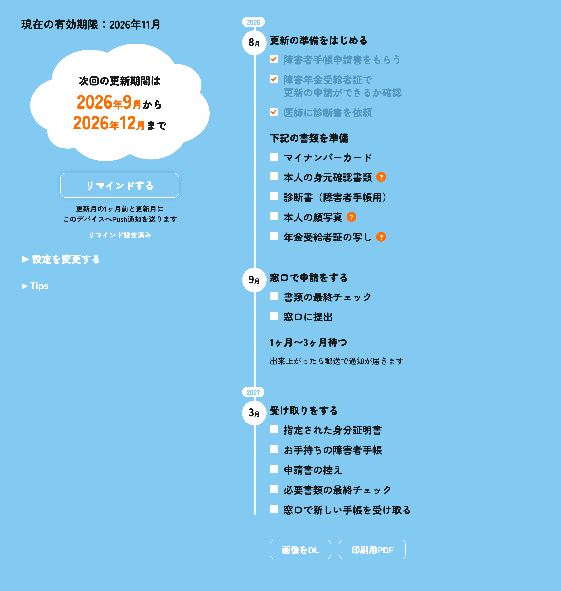

# 手帳更新通知サービス

■ URL
https://renewal-reminder.com




 - PWAで実装
 - Web Pushで通知

## セットアップ

```sh
npm install
npx wrangler login
npx wrangler d1 create renewal-reminder-db
npm run generate-types
npx wrangler d1 migrations apply renewal-reminder-db --local
npx wrangler d1 migrations apply renewal-reminder-db --remote
```

VAPID鍵はNode上で以下のように生成できる:

```sh
node --input-type=module -e "
import { generateVapidKeys } from '@mmmike/web-push/vapid';
console.log(JSON.stringify(await generateVapidKeys()));
"
```

- `publicKey` は `wrangler.jsonc` の `vars.VAPID_PUBLIC_KEY` に設定
- `privateKey` はローカル用に `.dev.vars` に `VAPID_PRIVATE_KEY=...` として保存(gitignore対象)し、本番用には `npx wrangler secret put VAPID_PRIVATE_KEY` で登録

## コマンド

| Command | Action |
| :--- | :--- |
| `npm run dev` | ローカル開発サーバー起動 (`localhost:4321`) |
| `npm run build` | 本番ビルド |
| `npx wrangler deploy` | Cloudflareへデプロイ |
| `npx wrangler d1 execute renewal-reminder-db --local --command "..."` | ローカルD1へのクエリ実行 |

## 動作確認

- `GET /api/debug/run-cron` : 本来Cron Triggerが行う送信処理を即時実行する検証用エンドポイント(認証なし、検証専用)
- iOSはSafariで開いた後「ホーム画面に追加」してPWAとして起動しないと通知許可が出せない

## ローカル環境のWeb Push通知の検証方法


■ 登録しているscheduleを確認
```sh
$ npx wrangler d1 execute renewal-reminder-db --local --command "SELECT * FROM schedules Order By created_at DESC"
```

■ 登録しているscheduleを更新
```sh
$ npx wrangler d1 execute renewal-reminder-db --local --command \
  "UPDATE schedules SET target_date = date('now','localtime'), sent_at = NULL WHERE id = <id>;"
```

■ デバッグ用のWeb Push通知を送信
```sh
$ curl -s http://localhost:4321/api/debug/run-cron
```